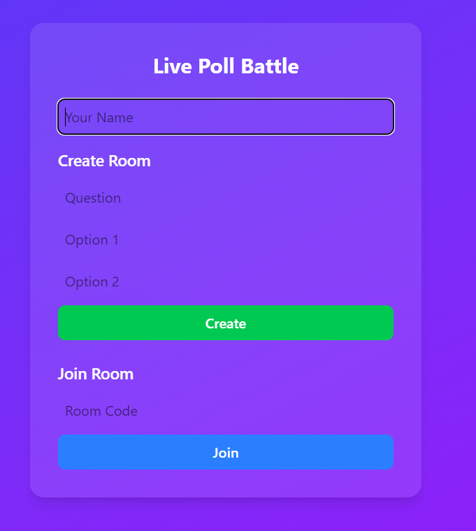
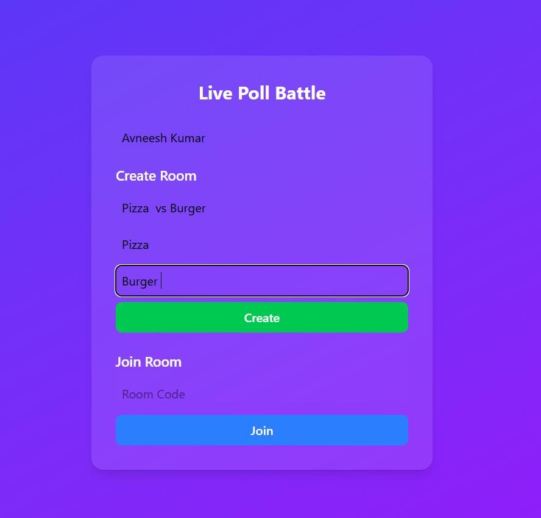
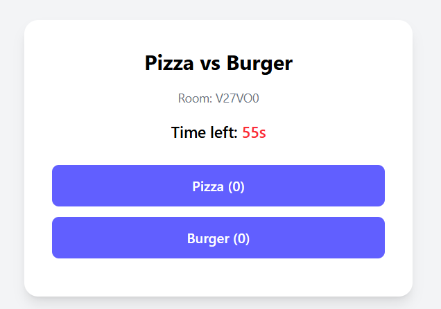
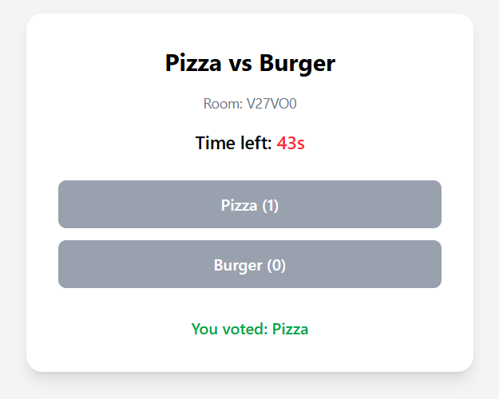

# 📊 Live Poll Battle  

A real-time polling application that allows users to create or join a poll room and vote live.  
The results update instantly across all users in the same room.  

Built with:  
- **Frontend:** React (Vite) + TailwindCSS  
- **Backend:** Node.js + Express + Socket.IO  
- **Persistence:** LocalStorage (votes persist across refreshes)  

---

## ⚙️ Setup Instructions  

1. Clone Repository  

git clone https://github.com/your-username/live-poll-battle.git
cd live-poll-battle

2. Backend Setup (Node.js + Socket.IO)
cd server
npm install
npm start

3. Frontend Setup (React + Vite)
cd ../client
npm install
npm run dev

✨ Features Implemented

--User Join/Create:
Users enter a name and either create a new poll room (with a question + 2 options) or join an existing one using a room code.

--Voting:
Each user can vote for one option only. Re-voting is prevented.

--Real-Time Updates:
Votes update live across all connected clients using WebSockets (Socket.IO).

--Countdown Timer:
Polls automatically close after 60 seconds. A countdown timer is displayed on the frontend.

--LocalStorage Persistence:
A user’s vote is stored in localStorage so that if they refresh, their vote remains in place.

--Room Codes:
Each poll room has a unique 6-character code generated using nanoid.

--Multiple Rooms Supported:
Several polls can run in parallel, each with independent state.

-----Frontend (React):

Each poll room maintains its own state (question, options, votes, endTime, closed).

LocalStorage is namespaced by vote:<roomCode>:<username> so that votes persist only for the specific poll and user.

Socket listeners (room_created, joined, state_updated, poll_closed) keep UI in sync with backend.

--------Backend (Node.js + Socket.IO):

Poll rooms are stored in-memory in a rooms object:

rooms = {
  ROOMCODE: {
    question,
    options,
    votes: { option1: 0, option2: 0 },
    users: { "Alice": { voted: null } },
    endTime,
    closed
  }
}

Room Creation: Generates a new code, initializes votes, and sets endTime.

Join Room: Adds a new user if name is unique and broadcasts updated state.

Vote: Increments vote count, marks user as voted, and broadcasts state.

Poll Closure: Uses setTimeout to auto-close after 60 seconds and emits "poll_closed".

## 📸 Screenshots

### 🟢 Join/Create Screen

### 🔵 Poll Screen

### 🔵 Vote Screen

